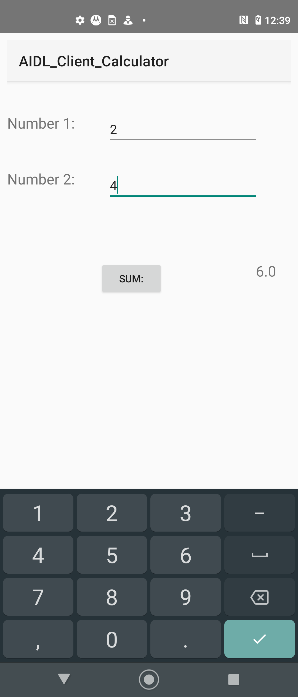

# Example how to use AIDL to call a method inside the other application

## APP 1 - AIDL_Service_Calculator
### This app service implement a sum method using AIDL

## APP 2 - AIDL_Client_Calculator
### This app client assign the AIDL on app service and call the sum method.

Reference -> https://medium.com/@paulo_linhares/android-deeplink-aidl-441774a09345